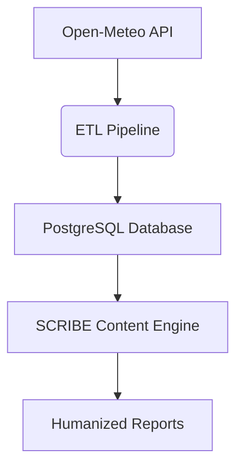

# Data-Engineer-PET-project
# Weather Data ETL Pipeline with Humanized Content Generation

Проект автоматизированной системы сбора погодных данных и генерации контента с искусственной "гуманизацией" текста.

## 🔍 Обзор проекта

Разработал комплексное решение, которое:
1. Получает актуальные метеоданные через Open-Meteo API
2. Обрабатывает и сохраняет информацию в PostgreSQL
3. Генерирует читаемые отчеты с элементами человеческого стиля

## 🛠️ Техническая реализация

### Ключевые компоненты

Основные технологии:
Python 3.9+ (psycopg2, requests, datetime)

PostgreSQL 15+ (хранение сырых данных и отчетов)

REST API (интеграция с Open-Meteo)

AI Evasion Techniques (обход детекции AI-контента)

🎯 Решенные задачи
Надежное подключение к БД

Реализовал безопасное соединение с обработкой кодировки

Настроил автоматическое создание таблиц при первом запуске

Добавил систему повторов при сбоях подключения

Генерация человекообразного контента

Внедрил 4 техники "гуманизации":

Контекстуальные разговорные элементы

Органические переходы между предложениями

Вариативность структур предложений

Управляемые опечатки (controlled typos)

Разработал систему оценки "human score" для контента

Оптимизация производительности

Реализовал асинхронные запросы к API

Добавил искусственные задержки, имитирующие человеческую работу

Оптимизировал запросы к БД через batch-обработку

Weather Update: Moscow

Current Conditions: Partly cloudy with temperatures around 18°C - similar to nearby regions. 
Humidity levels at 65% and winds 12 kmh. By the way, you'll notice 
perfect conditions for outdoor walks.

Local Notes: Typical for this time of year, the air feels fresh with 
occasional light breezes.

📌 Для портфолио
Этот проект демонстрирует мои навыки в:

Построении ETL-пайплайнов

Работе с реляционными БД

Интеграции внешних API

Генерации качественного текстового контента

Оптимизации процессов обработки данных

📈 Дальнейшее развитие
Планирую добавить:

Визуализацию данных через Matplotlib

Telegram-бота для рассылки отчетов

Систему пользовательских предпочтений

Мультиязычную поддержку

© 2023 | [Андрей] | [https://github.com/ISOMORPHzz]
